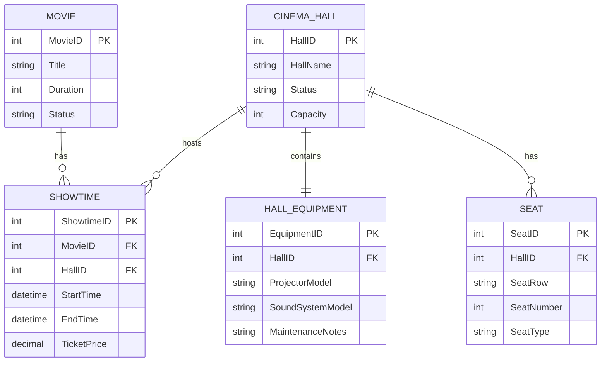

# BÁO CÁO BÀI TẬP: THIẾT KẾ PHÂN HỆ LỊCH CHIẾU VÀ PHÒNG CHIẾU PHIM - RIKKEI CINEMA

> 👤 **Học viên:** Đỗ Hoàng Sơn | **Mã SV:** PTIT-HCM-066
> 🏫 **Môn học:** IT105-K25-Phan-tich-thi-t-k-h-th-ng

---

## 📊 Sơ đồ thiết kế hệ thống (Class Diagram)

> 💡 *Sơ đồ dưới đây được render tự động trực tiếp trên GitHub bằng Mermaid. Bạn cũng có thể tải file **`bt4.drawio`** trong repository này để mở và chỉnh sửa trực tiếp trên [Draw.io (diagrams.net)](https://app.diagrams.net).* 

---

## Nhiệm vụ 1: Phân tích thực thể SHOWTIME và các quan hệ nghiệp vụ

Trong phần này, tôi tiến hành phân tích chi tiết cấu trúc dữ liệu cho thực thể SHOWTIME (Suất chiếu) để hoàn thiện khóa ngoại ShowtimeID đã dùng tạm ở Bài 2, đồng thời xác định rõ các thuộc tính, khóa chính và khóa ngoại cần thiết dựa trên quy tắc nghiệp vụ của Rikkei Cinema.

Mỗi suất chiếu là một sự kiện chiếu một bộ phim cụ thể tại một phòng chiếu trong một khung giờ nhất định. Do đó, SHOWTIME phải lưu trữ liên kết chặt chẽ với bảng MOVIE và CINEMA_HALL thông qua khóa ngoại.

- Thuộc tính của SHOWTIME: ShowtimeID (PK, INT, Auto Increment), MovieID (FK, INT), HallID (FK, INT), StartTime (DATETIME), EndTime (DATETIME), TicketPrice (DECIMAL).
- Ràng buộc khóa ngoại: MovieID tham chiếu tới MovieID trong bảng MOVIE; HallID tham chiếu tới HallID trong bảng CINEMA_HALL.
- Quan hệ 1-1 giữa CINEMA_HALL và HALL_EQUIPMENT: Mỗi phòng chiếu chỉ gắn liền với đúng 1 hồ sơ thiết bị ghi nhận model máy chiếu và hệ thống loa. Quan hệ này được quản lý bằng khóa ngoại nằm ở bảng HALL_EQUIPMENT trỏ về HallID của CINEMA_HALL, giúp tách bạch dữ liệu thiết bị và trạng thái vật lý của phòng.

## Nhiệm vụ 2: Xử lý các bẫy dữ liệu và Ràng buộc nghiệp vụ quan trọng

Khi thiết kế hệ thống rạp chiếu phim, việc xử lý các ngoại lệ (Edge Cases) và bẫy dữ liệu đóng vai trò quyết định tính toàn vẹn của lịch chiếu, tránh xung đột thời gian và lỗi vận hành thực tế.

Tôi đã áp dụng các giải pháp kỹ thuật cụ thể cho từng bài toán đặt ra trong đề bài như sau:

- Quan hệ Optional Zero-to-Many giữa MOVIE và SHOWTIME: Các bộ phim bom tấn mới nhập kho hệ thống nhưng chưa được xếp lịch chiếu sẽ có quan hệ dạng ||--o{ thay vì bắt buộc 1-1 hoặc 1-N thông thường. Điều này cho phép bảng MOVIE tồn tại các bản ghi chưa xuất hiện ở bảng SHOWTIME mà không vi phạm ràng buộc toàn vẹn tham chiếu.
- Quản lý trạng thái phòng chiếu (CINEMA_HALL.Status): Khi phòng chiếu gặp sự cố âm thanh hoặc cơ sở vật chất, nhân viên kỹ thuật sẽ cập nhật thuộc tính Status thành 'Under Maintenance'. Hệ thống quản lý lịch chiếu sẽ đọc trạng thái này để tự động chặn việc xếp lịch mới vào phòng đang sửa chữa.
- Phân tách trách nhiệm dữ liệu: Nguyên nhân hỏng hóc chi tiết của thiết bị được ghi nhận tại thuộc tính MaintenanceNotes của bảng HALL_EQUIPMENT, tuyệt đối không lặp lại hay trộn lẫn vào bảng CINEMA_HALL nhằm giữ chuẩn hóa cơ sở dữ liệu ở mức tối thiểu 3NF.

## Nhiệm vụ 3: Bảng đặc tả chi tiết cấu trúc cơ sở dữ liệu Suất chiếu

Dưới đây là bảng tổng hợp chi tiết các thuộc tính, kiểu dữ liệu và ràng buộc của thực thể SHOWTIME và các thực thể liên quan trong phân hệ:

| Tên thực thể | Tên thuộc tính | Kiểu dữ liệu | Khóa (PK/FK) | Mô tả / Ràng buộc nghiệp vụ |
| --- | --- | --- | --- | --- |
| SHOWTIME | ShowtimeID | INT | PK | Mã suất chiếu duy nhất, tự tăng |
| SHOWTIME | MovieID | INT | FK | Mã phim được xếp chiếu trong suất này |
| SHOWTIME | HallID | INT | FK | Mã phòng chiếu tổ chức suất chiếu |
| SHOWTIME | StartTime | DATETIME | - | Thời điểm bắt đầu suất chiếu (Không được trùng lặp phòng trong khung giờ này) |
| SHOWTIME | EndTime | DATETIME | - | Thời điểm kết thúc suất chiếu (Tính toán dựa vào thời lượng phim cộng thời gian dọn dẹp) |
| SHOWTIME | TicketPrice | DECIMAL(10,2) | - | Giá vé cơ bản áp dụng cho suất chiếu |
| CINEMA_HALL | Status | VARCHAR(50) | - | Trạng thái phòng ('Active', 'Under Maintenance', 'Closed') |

---

## 📁 Danh sách tệp tin nộp bài trong Repository
- 📝 `bt4.docx`: Báo cáo tài liệu phân tích nghiệp vụ hoàn chỉnh.
- 🎨 `bt4.drawio`: File thiết kế sơ đồ chuẩn theo quy định đề bài (mở trực tiếp bằng [Draw.io](https://app.diagrams.net) hoặc Lucidchart).
